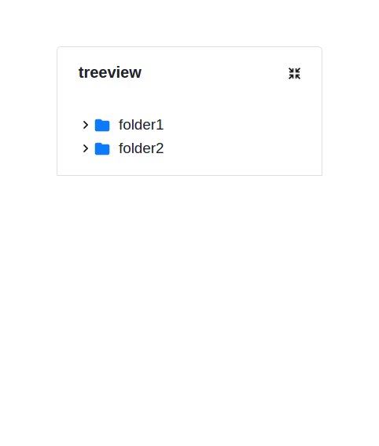

# React File TreeView

A simple, flexible file hierarchy tree component for react.

## Installation

```
npm i react-file-treeview react-bootstrap bootstrap
```

## Usage

```javascript
//Add Imports*
import "bootstrap/dist/css/bootstrap.min.css";
import "bootstrap/dist/js/bootstrap.min.js";
import FileTree from "react-file-treeview";

function App() {
  //create tree data*
  const data = {
    name: "treeview",
    id: 1,
    toggled: true,
    child: [
      {
        name: "folder1",
        id: 2,
        child: [
          {
            name: "folder2",
            id: 5,
            child: [
              { name: "file3.py", id: 6, child: [] },
              { name: "file4.cpp", id: 7, child: [] },
            ],
          },
          { name: "file1.js", id: 3, child: [] },
          { name: "file2.ts", id: 4, child: [] },
        ],
      },
    ],
  };

  //create Collapse button data
  const [collapseAll, setCollapseAll] = useState(false);
  const handleCollapseAll = (value) => setCollapseAll(value);

  //Create file action data*
  const handleFileOnClick = (file) => {
    console.log(file);
  };

  const action = {
    fileOnClick: handleFileOnClick,
  };

  //Create Decoration data*
  const treeDecorator = {
    showIcon: true,
    iconSize: 18,
    textSize: 15,
    showCollapseAll: true,
  };

  return (
    <div>
      <button onClick={() => setCollapseAll(true)}>Collapse All</button>
      <FileTree
        data={data}
        action={action} //optional
        collapseAll={{ collapseAll, handleCollapseAll }} //Optional
        decorator={treeDecorator} //Optional
      />
    </div>
  );
}
```

### Package Used

- `create react app`
- `react-bootstraps`
- `bootstrap`
- `file-extension-icon-JS`

### Demo


